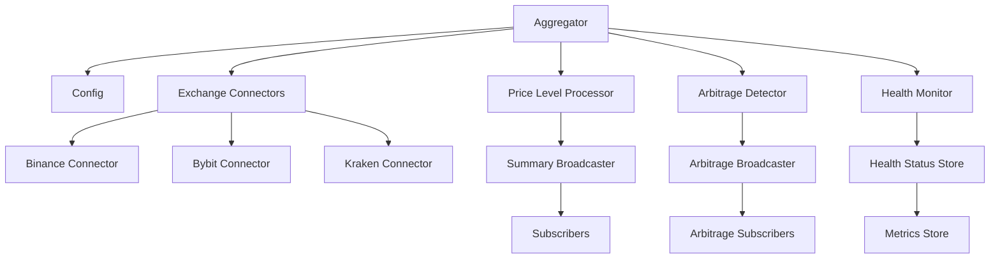
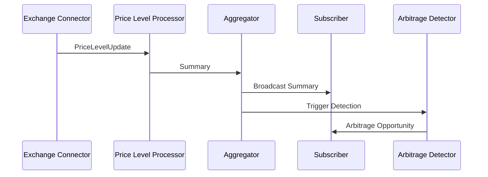
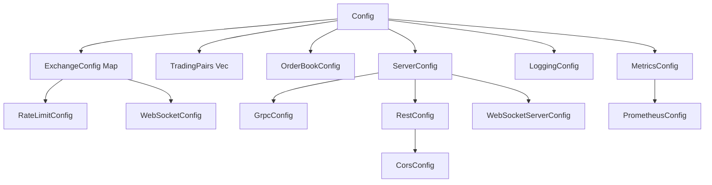
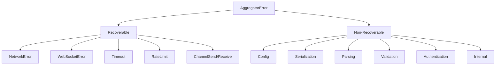
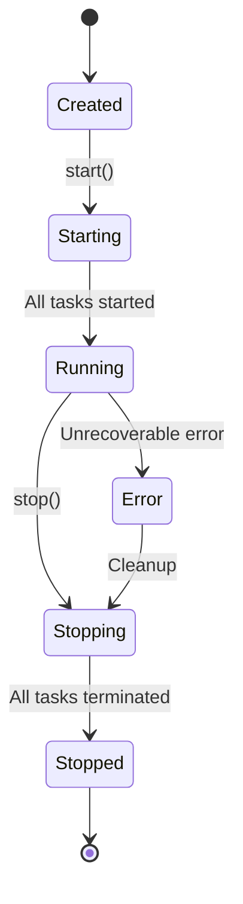
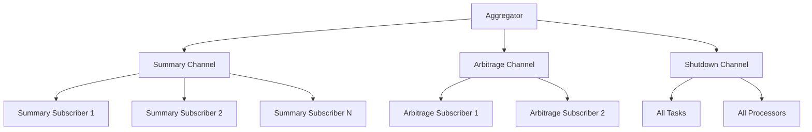

# Aggregator-Core Audit Report

## Executive Summary

This report documents the complete audit of the `aggregator-core` crate, analyzing its public API, module boundaries, key concepts, usage patterns, and test coverage. The crate serves as the core aggregation logic for cryptocurrency orderbook data.

## 1. Public API Analysis

### 1.1 Core Modules and Re-exports

The crate exposes four main modules through `lib.rs`:

```rust
pub mod aggregator;
pub mod config;
pub mod error;
pub mod types;

pub use aggregator::*;
pub use config::*;
pub use error::*;
pub use types::*;
```

### 1.2 Primary Public Interfaces

#### `Aggregator` Struct
The main orchestrator for cryptocurrency orderbook aggregation:

```rust
pub struct Aggregator {
    // Internal state management with Arc<RwLock<T>> for thread safety
    config: Arc<Config>,
    summaries: Arc<RwLock<HashMap<TradingPair, Summary>>>,
    health_status: Arc<RwLock<HashMap<Exchange, HealthStatus>>>,
    metrics: Arc<RwLock<HashMap<Exchange, Metrics>>>,
    // Broadcast channels for real-time updates
    summary_sender: broadcast::Sender<Summary>,
    arbitrage_sender: broadcast::Sender<ArbitrageOpportunity>,
    shutdown_sender: broadcast::Sender<()>,
}
```

**Key Methods:**
- `new(config: Config) -> Self` - Constructor
- `async fn start() -> Result<Vec<JoinHandle<Result<()>>>>` - Starts aggregation services
- `async fn stop() -> Result<()>` - Graceful shutdown
- `subscribe_summaries() -> broadcast::Receiver<Summary>` - Real-time summary updates
- `subscribe_arbitrage() -> broadcast::Receiver<ArbitrageOpportunity>` - Arbitrage opportunities
- `async fn get_summary(&self, pair: &TradingPair) -> Option<Summary>` - Point-in-time data access
- `async fn get_health_status(&self, exchange: &Exchange) -> Option<HealthStatus>` - Health monitoring

#### `Config` Struct
Hierarchical configuration system:

```rust
pub struct Config {
    pub exchanges: HashMap<Exchange, ExchangeConfig>,
    pub trading_pairs: Vec<TradingPair>,
    pub orderbook: OrderBookConfig,
    pub server: ServerConfig,
    pub logging: LoggingConfig,
    pub metrics: MetricsConfig,
}
```

**Key Methods:**
- `Default::default()` - Default configuration with all exchanges enabled
- `from_file(path: &str) -> Result<Self>` - Load from JSON file
- `to_file(&self, path: &str) -> Result<()>` - Save to JSON file
- `enabled_exchanges(&self) -> Vec<Exchange>` - Get active exchanges

## 2. Module Boundaries

### 2.1 Aggregator Module (`aggregator.rs`)
- **Responsibility**: Core aggregation orchestration and lifecycle management
- **Dependencies**: Config, Types, Error modules
- **External Dependencies**: tokio, tracing, chrono, uuid
- **Key Components**:
  - Exchange connector management
  - Price level processing
  - Arbitrage detection
  - Health monitoring
  - Async task coordination

### 2.2 Config Module (`config.rs`)
- **Responsibility**: Configuration management and validation
- **Dependencies**: Types, Error modules
- **External Dependencies**: serde, serde_json, thiserror
- **Key Components**:
  - Hierarchical configuration structures
  - Default implementations
  - File I/O operations
  - Validation logic

### 2.3 Error Module (`error.rs`)
- **Responsibility**: Comprehensive error handling and taxonomy
- **Dependencies**: Config module
- **External Dependencies**: thiserror, tokio, reqwest, tungstenite, url, uuid
- **Key Components**:
  - Error type definitions
  - Error conversion implementations
  - Error categorization
  - Recoverable error identification

### 2.4 Types Module (`types.rs`)
- **Responsibility**: Core data structures and primitives
- **Dependencies**: Error module
- **External Dependencies**: chrono, serde, uuid
- **Key Components**:
  - Exchange enumeration
  - Order book primitives (Bid, Ask, PriceLevel)
  - Trading pair representation
  - Market data structures

## 3. Key Concepts

### 3.1 Aggregator Lifecycle

The aggregator follows a clear lifecycle pattern:

1. **Initialization**: Create with configuration
2. **Startup**: Initialize health status and start services
3. **Operation**: Process price updates and detect arbitrage
4. **Shutdown**: Graceful termination via broadcast signal

### 3.2 Config Hierarchy

The configuration system is hierarchical and modular:

```
Config
├── ExchangeConfig (per exchange)
│   ├── RateLimitConfig
│   └── WebSocketConfig
├── OrderBookConfig
├── ServerConfig
│   ├── GrpcConfig
│   ├── RestConfig
│   └── WebSocketServerConfig
├── LoggingConfig
└── MetricsConfig
    └── PrometheusConfig
```

### 3.3 Error Taxonomy

Comprehensive error handling with 20+ error types:

- **Recovery Classification**: `is_recoverable()` method
- **Categorization**: `category()` method returns static strings
- **Conversion**: Automatic conversion from external error types
- **Context**: Rich context information for debugging

### 3.4 Order Book Primitives

Core data structures for market data:

- **PriceLevel**: Basic price/quantity/exchange/timestamp tuple
- **Bid**: Buy orders with reverse price ordering (higher is better)
- **Ask**: Sell orders with normal price ordering (lower is better)
- **Summary**: Aggregated market data with spread calculation
- **PriceLevelUpdate**: Real-time update container

### 3.5 Async Stream Usage

The system uses Tokio's async runtime extensively:

- **Broadcast Channels**: For real-time data distribution
- **MPSC Channels**: For internal data flow
- **Select Macro**: For handling shutdown signals
- **Spawn Tasks**: For concurrent processing

### 3.6 Subscription Model

Event-driven architecture with subscription patterns:

- **Summary Updates**: Real-time market data aggregation
- **Arbitrage Opportunities**: Cross-exchange price discrepancies
- **Health Status**: Exchange connectivity monitoring
- **Metrics**: Performance and error tracking

## 4. Code Snippets and Interaction Sequences

### 4.1 Basic Usage Pattern

```rust
// Create aggregator with default configuration
let config = Config::default();
let aggregator = Aggregator::new(config);

// Subscribe to real-time updates
let mut summary_rx = aggregator.subscribe_summaries();
let mut arbitrage_rx = aggregator.subscribe_arbitrage();

// Start aggregation services
let handles = aggregator.start().await?;

// Process real-time updates
tokio::select! {
    Ok(summary) = summary_rx.recv() => {
        println!("New summary: {:?}", summary);
    }
    Ok(opportunity) = arbitrage_rx.recv() => {
        println!("Arbitrage opportunity: {:?}", opportunity);
    }
}

// Graceful shutdown
aggregator.stop().await?;
```

### 4.2 Configuration Management

```rust
// Load configuration from file
let config = Config::from_file("config.json")?;

// Modify configuration
let mut config = Config::default();
config.exchanges.get_mut(&Exchange::Binance).unwrap().enabled = false;
config.trading_pairs.push(TradingPair::new("ETH", "BTC"));

// Save configuration
config.to_file("updated_config.json")?;

// Get enabled exchanges
let enabled = config.enabled_exchanges();
```

### 4.3 Error Handling Patterns

```rust
// Recoverable error handling
match result {
    Ok(data) => process_data(data),
    Err(e) if e.is_recoverable() => {
        tracing::warn!("Recoverable error: {}", e);
        // Implement retry logic
    }
    Err(e) => {
        tracing::error!("Non-recoverable error in {}: {}", e.category(), e);
        return Err(e);
    }
}

// Custom error creation
let error = AggregatorError::parsing("OrderBook", "Invalid price format");
let timeout_error = AggregatorError::timeout("fetch_data", 5000);
```

### 4.4 Type System Usage

```rust
// Trading pair creation and parsing
let pair = TradingPair::new("btc", "usd"); // Automatically uppercased
let pair_from_str = TradingPair::from_str("ETH/USDT")?;

// Exchange enumeration
for exchange in Exchange::all() {
    println!("Exchange: {}", exchange); // Uses Display trait
}
let exchange = Exchange::from_str("binance")?;

// Order book data structures
let bid = Bid {
    price: 50000.0,
    quantity: 1.5,
    exchange: Exchange::Binance,
    timestamp: Utc::now(),
};

// Ordering: higher price bids are better
let mut bids = vec![bid1, bid2, bid3];
bids.sort(); // Automatically sorted by price descending
```

## 5. Test Coverage Analysis

### 5.1 Test Structure

Tests are organized in separate files within the `tests/` directory:

- `aggregator_tests.rs` - Core aggregator functionality (8 tests)
- `config_tests.rs` - Configuration management (4 tests)
- `types_tests.rs` - Type system validation (12 tests)
- `error_tests.rs` - Error handling (commented out, 17 potential tests)

### 5.2 Test Coverage Summary

**Aggregator Module:**
- ✅ Constructor and subscriptions
- ✅ Start/stop lifecycle
- ✅ Data accessor methods
- ✅ Health status initialization
- ✅ Price level processing
- ✅ Arbitrage detection (negative case)
- ✅ Health monitoring
- ❌ Exchange connector integration (placeholder implementation)

**Config Module:**
- ✅ Configuration structure validation
- ✅ Default implementations
- ❌ File I/O operations
- ❌ Validation logic
- ❌ Error handling

**Types Module:**
- ✅ Exchange enum operations
- ✅ Trading pair creation and parsing
- ✅ Order book primitive ordering
- ✅ Data structure construction
- ✅ Default implementations
- ✅ Serialization/deserialization

**Error Module:**
- ❌ All error tests commented out
- ❌ Error conversion testing
- ❌ Recovery classification
- ❌ Error categorization

### 5.3 Test Quality Assessment

**Strengths:**
- Comprehensive type system testing
- Good async testing patterns
- Proper use of tokio::test
- Integration-style testing for aggregator

**Weaknesses:**
- No error handling tests active
- Missing file I/O testing
- No validation testing
- Limited edge case coverage

## 6. Architecture Insights

### 6.1 Design Patterns

1. **Actor Model**: Aggregator manages multiple async tasks
2. **Observer Pattern**: Broadcast channels for event distribution
3. **Factory Pattern**: Default implementations for configuration
4. **Builder Pattern**: Struct construction with defaults
5. **Strategy Pattern**: Pluggable OrderBook implementations

### 6.2 Concurrency Model

- **Shared State**: Arc<RwLock<T>> for thread-safe shared access
- **Message Passing**: Channels for inter-task communication
- **Task Coordination**: Shutdown signals via broadcast channels
- **Async/Await**: Throughout the codebase for non-blocking operations

### 6.3 Error Handling Strategy

- **Centralized Error Types**: Single AggregatorError enum
- **Rich Context**: Detailed error information
- **Automatic Conversion**: From external library errors
- **Recovery Guidance**: Built-in recoverability classification

## 7. Mermaid Diagram Outlines

### 7.1 Architecture Overview Diagram



### 7.2 Data Flow Diagram



### 7.3 Configuration Hierarchy Diagram



### 7.4 Error Taxonomy Diagram



### 7.5 Lifecycle State Diagram



### 7.6 Subscription Model Diagram



## 8. Recommendations

### 8.1 Code Quality
1. **Activate Error Tests**: Uncomment and fix error tests
2. **Add Integration Tests**: Test file I/O and configuration validation
3. **Improve Documentation**: Add more inline documentation
4. **Edge Case Testing**: Test error conditions and boundary cases

### 8.2 API Improvements
1. **Builder Pattern**: Consider builder pattern for complex configurations
2. **Async Traits**: Consider async traits for exchange connectors
3. **Type Safety**: Use newtypes for price/quantity values
4. **Error Context**: Add more context to error messages

### 8.3 Performance
1. **Memory Management**: Consider object pooling for frequent allocations
2. **Batch Processing**: Batch price level updates for efficiency
3. **Lock Contention**: Minimize lock hold times
4. **Channel Capacity**: Tune channel buffer sizes

### 8.4 Maintainability
1. **Modular Design**: Split large modules into smaller ones
2. **Dependency Injection**: Make dependencies more explicit
3. **Configuration Validation**: Add runtime configuration validation
4. **Logging**: Add structured logging throughout

## 9. Conclusion

The `aggregator-core` crate provides a solid foundation for cryptocurrency orderbook aggregation with:

- **Strengths**: Well-structured async architecture, comprehensive error handling, flexible configuration system
- **Areas for Improvement**: Test coverage, documentation, performance optimization
- **Architecture**: Clean separation of concerns with appropriate use of Rust's type system and async capabilities

The codebase demonstrates good Rust practices and provides a robust foundation for building a cryptocurrency trading platform.
