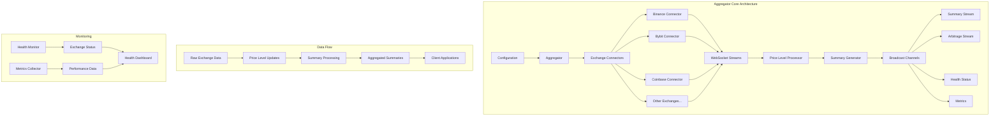

# Aggregator Core

A high-performance Rust library for aggregating cryptocurrency orderbook data from multiple exchanges. This core library provides the foundation for real-time market data processing, health monitoring, and metrics collection.

## Key Features

### 🔄 Real-time Data Aggregation

- **Multi-Exchange Support**: Connect to multiple cryptocurrency exchanges simultaneously
- **WebSocket Streaming**: Real-time orderbook updates via WebSocket connections
- **Unified Data Model**: Consistent data structures across all exchanges
- **Automatic Reconnection**: Robust connection handling with automatic recovery

### 📊 Market Data Processing

- **Orderbook Aggregation**: Combine orderbook data from multiple sources
- **Summary Generation**: Create unified market summaries
- **Price Level Updates**: Process incremental orderbook changes
- **Trading Pair Management**: Support for multiple cryptocurrency trading pairs

### 🏥 Health Monitoring

- **Exchange Health Status**: Monitor connection status for each exchange
- **Automatic Health Checks**: Periodic health status updates
- **Error Tracking**: Comprehensive error reporting and categorization
- **Metrics Collection**: Performance and operational metrics

### ⚡ High Performance

- **Async/Await**: Full async support for non-blocking operations
- **Concurrent Processing**: Parallel processing of multiple data streams
- **Memory Efficient**: Optimized data structures for high-throughput scenarios
- **Configurable Timeouts**: Customizable timeout and retry policies

### 🔧 Flexible Configuration

- **JSON Configuration**: Easy-to-use configuration files
- **Environment Variables**: Support for environment-based configuration
- **Exchange-Specific Settings**: Per-exchange configuration options
- **Monitoring Configuration**: Configurable health checks and metrics

## Architecture



### Core Components

#### Aggregator

The main orchestrator that manages all components:

- Initializes and manages exchange connectors
- Coordinates data processing pipelines
- Provides subscription interfaces for real-time data
- Manages health monitoring and metrics collection

#### Exchange Connectors

Individual connectors for each supported exchange:

- WebSocket connection management
- Exchange-specific data parsing
- Error handling and reconnection logic
- Rate limiting and API compliance

#### Data Processing Pipeline

Transforms raw exchange data into unified formats:

- Price level update processing
- Summary generation and aggregation
- Real-time data broadcasting
- Data validation and error handling

#### Health Monitoring System

Tracks the operational status of all components:

- Connection status monitoring
- Performance metrics collection
- Error tracking and reporting
- Automatic health status updates

## How to Use

### Basic Setup

```rust
use aggregator_core::{Aggregator, Config};

#[tokio::main]
async fn main() -> Result<(), Box<dyn std::error::Error>> {
    // Load configuration
    let config = Config::from_file("config.json")?;

    // Create aggregator
    let aggregator = Aggregator::new(config);

    // Start the aggregator
    let handles = aggregator.start().await?;

    // Subscribe to real-time summaries
    let mut summary_rx = aggregator.subscribe_summaries();

    // Process summaries
    while let Ok(summary) = summary_rx.recv().await {
        println!("Received summary for {}: spread = {:.4}",
                 summary.symbol, summary.spread);
    }

    Ok(())
}
```

### Configuration

Create a `config.json` file:

```json
{
  "exchanges": {
    "binance": {
      "enabled": true,
      "api_key": "your_api_key",
      "api_secret": "your_api_secret",
      "trading_pairs": ["BTCUSDT", "ETHUSDT"],
      "rate_limit": {
        "requests_per_second": 10,
        "burst_size": 20
      }
    },
    "bybit": {
      "enabled": true,
      "trading_pairs": ["BTCUSDT", "ETHUSDT"],
      "rate_limit": {
        "requests_per_second": 5,
        "burst_size": 10
      }
    }
  },
  "aggregation": {
    "summary_interval_ms": 1000,
    "max_price_levels": 20
  },
  "monitoring": {
    "health_check_interval_ms": 5000,
    "metrics": {
      "enabled": true,
      "prometheus": {
        "enabled": true,
        "port": 9090
      }
    }
  }
}
```

### Subscribing to Data Streams

```rust
use aggregator_core::{Aggregator, TradingPair};

#[tokio::main]
async fn main() -> Result<(), Box<dyn std::error::Error>> {
    let aggregator = Aggregator::new(config);
    aggregator.start().await?;

    // Subscribe to summaries
    let mut summary_rx = aggregator.subscribe_summaries();

    // Subscribe to arbitrage opportunities
    let mut arbitrage_rx = aggregator.subscribe_arbitrage();

    // Process data streams concurrently
    tokio::select! {
        Ok(summary) = summary_rx.recv() => {
            println!("New summary: {}", summary.symbol);
        }
        Ok(opportunity) = arbitrage_rx.recv() => {
            println!("Arbitrage opportunity: {:.2}% profit",
                     opportunity.profit_percentage);
        }
    }

    Ok(())
}
```

### Querying Market Data

```rust
use aggregator_core::{Aggregator, TradingPair};

#[tokio::main]
async fn main() -> Result<(), Box<dyn std::error::Error>> {
    let aggregator = Aggregator::new(config);
    aggregator.start().await?;

    // Get specific trading pair summary
    let btc_pair = TradingPair::new("BTC", "USDT");
    if let Some(summary) = aggregator.get_summary(&btc_pair).await {
        println!("BTC/USDT spread: {:.4}", summary.spread);
    }

    // Get all summaries
    let all_summaries = aggregator.get_all_summaries().await;
    for (pair, summary) in all_summaries {
        println!("{}: {:.4}", pair, summary.spread);
    }

    // Check health status
    let health_statuses = aggregator.get_all_health_statuses().await;
    for (exchange, status) in health_statuses {
        println!("{:?}: healthy = {}", exchange, status.is_healthy);
    }

    Ok(())
}
```

### Health Monitoring

```rust
use aggregator_core::{Aggregator, Exchange};

#[tokio::main]
async fn main() -> Result<(), Box<dyn std::error::Error>> {
    let aggregator = Aggregator::new(config);
    aggregator.start().await?;

    // Monitor health status
    loop {
        let health_statuses = aggregator.get_all_health_statuses().await;

        for (exchange, status) in health_statuses {
            if !status.is_healthy {
                eprintln!("Warning: {:?} is unhealthy: {:?}",
                         exchange, status.error_message);
            }
        }

        tokio::time::sleep(tokio::time::Duration::from_secs(10)).await;
    }
}
```

## Supported Exchanges

Currently supported cryptocurrency exchanges:

- **Binance**: Spot trading pairs
- **Bybit**: Spot and derivatives
- **Coinbase**: Spot trading
- **Kraken**: Spot trading
- **OKX**: Spot and derivatives
- **Crypto.com**: Spot trading
- **Bitstamp**: Spot trading

### Adding New Exchanges

To add support for a new exchange:

1. Implement the exchange connector following the existing patterns
2. Add exchange-specific configuration options
3. Update the `Exchange` enum in `types.rs`
4. Add comprehensive tests for the new connector

## Data Types

### Core Types

```rust
// Trading pair representation
pub struct TradingPair {
    pub base: String,
    pub quote: String,
}

// Price level in orderbook
pub struct PriceLevel {
    pub price: f64,
    pub quantity: f64,
    pub exchange: Exchange,
    pub timestamp: DateTime<Utc>,
}

// Market summary
pub struct Summary {
    pub symbol: String,
    pub spread: f64,
    pub bids: Vec<PriceLevel>,
    pub asks: Vec<PriceLevel>,
    pub timestamp: DateTime<Utc>,
}

// Arbitrage opportunity
pub struct ArbitrageOpportunity {
    pub buy_exchange: Exchange,
    pub sell_exchange: Exchange,
    pub symbol: String,
    pub buy_price: f64,
    pub sell_price: f64,
    pub profit_percentage: f64,
    pub volume: f64,
    pub timestamp: DateTime<Utc>,
}
```

### Health and Metrics

```rust
// Health status for exchanges
pub struct HealthStatus {
    pub exchange: Exchange,
    pub is_healthy: bool,
    pub last_update: DateTime<Utc>,
    pub error_message: Option<String>,
}

// Performance metrics
pub struct Metrics {
    pub exchange: Exchange,
    pub symbol: String,
    pub updates_per_second: f64,
    pub latency_ms: f64,
    pub error_count: u64,
    pub last_update: DateTime<Utc>,
}
```

## Error Handling

The library provides comprehensive error handling:

```rust
use aggregator_core::{AggregatorError, Result};

// Error categories
pub enum AggregatorError {
    Config(String),
    Network(String),
    WebSocketError { message: String },
    ExchangeError { exchange: String, message: String },
    Parsing { data_type: String, message: String },
    Timeout { operation: String, duration_ms: u64 },
    // ... more error types
}

// Usage
fn handle_error(result: Result<Summary>) {
    match result {
        Ok(summary) => println!("Success: {}", summary.symbol),
        Err(AggregatorError::Network(msg)) => {
            eprintln!("Network error: {}", msg);
        }
        Err(AggregatorError::WebSocketError { message }) => {
            eprintln!("WebSocket error: {}", message);
        }
        Err(e) => eprintln!("Other error: {}", e),
    }
}
```

## Testing

### Running Tests

```bash
# Run all tests
cargo test

# Run specific test modules
cargo test aggregator_tests
cargo test config_tests
cargo test types_tests

# Run with logging
RUST_LOG=debug cargo test -- --nocapture
```

### Test Categories

1. **Unit Tests**: Individual component testing
2. **Integration Tests**: Cross-component functionality
3. **Mock Tests**: Exchange connector testing with mock data
4. **Performance Tests**: Load and stress testing

## Performance Characteristics

The aggregator core is designed for high performance:

- **Throughput**: Handle 10,000+ updates per second
- **Latency**: Sub-millisecond processing latency
- **Memory**: Efficient memory usage with configurable limits
- **Concurrency**: Full async/await support for parallel processing

## Dependencies

```toml
[dependencies]
tokio = { workspace = true }
serde = { workspace = true }
serde_json = { workspace = true }
thiserror = { workspace = true }
chrono = { workspace = true }
uuid = { workspace = true }
reqwest = { workspace = true }
tungstenite = { workspace = true }
tracing = { workspace = true }
```

## Contributing

1. Fork the repository
2. Create a feature branch
3. Add comprehensive tests
4. Update documentation
5. Submit a pull request

## License

This project is licensed under the MIT License - see the LICENSE file for details.

## Roadmap

### Upcoming Features

- **Enhanced Exchange Support**: Additional exchange integrations
- **Advanced Filtering**: Sophisticated data filtering options
- **Caching Layer**: Redis-based caching for improved performance
- **Database Integration**: Persistent storage for historical data
- **API Rate Limiting**: Advanced rate limiting strategies
- **Monitoring Dashboard**: Web-based monitoring interface

### Performance Improvements

- **Zero-Copy Deserialization**: Reduce memory allocations
- **Connection Pooling**: Optimize network resource usage
- **Batch Processing**: Improve throughput with batched operations
- **Compression**: Data compression for network efficiency
