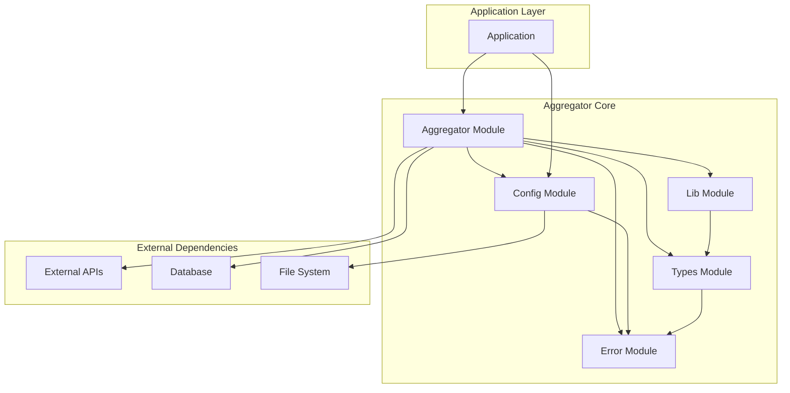

# Aggregator Core

## Purpose & Key Features

The *aggregator-core* is the backbone of the AggreGate platform, providing essential components for aggregating cryptocurrency order-book data. By interfacing with multiple exchanges, it facilitates high-frequency updates and efficient data processing.

### Key Features:
- Real-time data aggregation from multiple exchanges.
- Extensible design allowing integration with new exchanges effortlessly.
- High-performance order-book handling using configurable strategies.
- Robust error handling and logging.

## Supported Exchanges & Extensibility Strategy

Currently Supported Exchanges:
- Binance
- Bitstamp
- Bybit
- Kraken
- Coinbase
- Crypto.com
- OKX

Extensibility Strategy:
The system is designed with modular exchange connectors, allowing developers to add new exchanges by implementing the `Exchange` interface, following examples in existing modules.

## High-Level Architecture




## Quick-Start Example

Here's a quick-start example of how to initialize and start the aggregator:
```rust
use aggregator_core::{Aggregator, Config};

fn main() -> Result<(), Box<dyn std::error::Error>> {
    let config = Config::default();
    let aggregator = Aggregator::new(config);
    
    // Start the aggregator
    tokio::runtime::Builder::new_multi_thread()
        .worker_threads(2)
        .enable_all()
        .build()
        .unwrap()
        .block_on(async {
            aggregator.start().await?;
            Ok(())
        })
}
```

## Installation & Build Instructions

To include *aggregator-core* in your project, add the following line to your `Cargo.toml`:
```toml
[dependencies]
aggregator-core = { path = "aggregator-core" }
```

Use the following command to add it via Cargo:
```bash
cargo add aggregator-core
```

## Links to Deeper Module Docs & API Examples

- [API Examples](../docs/aggregator-core-doc/api-examples.md)
- [Aggregator Module Documentation](../docs/aggregator-core-doc/modules/aggregator.md)
- [Lib Module Documentation](../docs/aggregator-core-doc/modules/lib.md)

