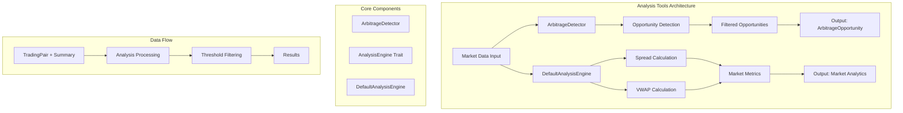

# Analysis Tools

A comprehensive Rust library for cryptocurrency arbitrage detection and market analytics. This library provides high-performance tools for analyzing orderbook data, detecting arbitrage opportunities, and calculating market metrics.

## Key Features

### 🔍 Arbitrage Detection

- **Simple Arbitrage**: Detect price differences between exchanges for the same trading pair
- **Configurable Thresholds**: Set minimum profit and volume thresholds
- **Multi-Exchange Support**: Analyze opportunities across multiple cryptocurrency exchanges
- **Real-time Processing**: Async/await support for high-performance real-time analysis

### 📊 Market Analytics

- **Spread Calculation**: Calculate bid-ask spreads for market analysis
- **VWAP (Volume Weighted Average Price)**: Compute volume-weighted prices across order book levels
- **Market Summary Analysis**: Process and analyze market summaries from multiple sources

### ⚡ Performance & Scalability

- **High-Performance Processing**: Handle thousands of trading pairs efficiently
- **Concurrent Processing**: Thread-safe operations for parallel analysis
- **Memory Efficient**: Optimized for large dataset processing
- **Configurable Processing Limits**: Built-in timeouts and resource management

### 🧪 Comprehensive Testing

- **Unit Tests**: Extensive test coverage for all components
- **Integration Tests**: Full integration testing with aggregator-core types
- **Performance Tests**: Benchmarks for processing time and memory usage
- **Edge Case Handling**: Robust testing for error conditions and edge cases

## Architecture



### Core Components

#### ArbitrageDetector

The main component for detecting arbitrage opportunities:

- Configurable profit and volume thresholds
- Multi-exchange comparison logic
- Async processing for real-time analysis
- Future support for triangular arbitrage and negative cycle detection

#### AnalysisEngine Trait

Defines the interface for market analysis operations:

- `analyze_summaries()`: Find arbitrage opportunities in market data
- `calculate_spread()`: Compute bid-ask spreads
- `calculate_volume_weighted_price()`: Calculate VWAP

#### DefaultAnalysisEngine

Default implementation of the AnalysisEngine trait:

- Efficient summary analysis
- Robust spread and VWAP calculations
- Integration with aggregator-core types

## How to Use

### Basic Usage

```rust
use analysis_tools::{ArbitrageDetector, AnalysisEngine, DefaultAnalysisEngine};
use aggregator_core::{TradingPair, Summary, Exchange};
use std::collections::HashMap;

#[tokio::main]
async fn main() -> Result<(), Box<dyn std::error::Error>> {
    // Create an arbitrage detector with custom thresholds
    let detector = ArbitrageDetector::new(
        0.1,  // 0.1% minimum profit threshold
        0.01  // 0.01 minimum volume threshold
    );

    // Prepare market data (TradingPair -> Vec<Summary>)
    let mut market_data = HashMap::new();
    let btc_pair = TradingPair::new("BTC", "USDT");

    // Add summaries from different exchanges
    let summaries = vec![
        create_binance_summary(),
        create_bybit_summary(),
    ];
    market_data.insert(btc_pair, summaries);

    // Detect arbitrage opportunities
    let opportunities = detector.detect_opportunities(&market_data).await;

    for opportunity in opportunities {
        println!("Arbitrage Opportunity:");
        println!("  Symbol: {}", opportunity.symbol);
        println!("  Buy on: {:?} at ${:.2}", opportunity.buy_exchange, opportunity.buy_price);
        println!("  Sell on: {:?} at ${:.2}", opportunity.sell_exchange, opportunity.sell_price);
        println!("  Profit: {:.2}%", opportunity.profit_percentage);
        println!("  Volume: {:.4}", opportunity.volume);
    }

    Ok(())
}
```

### Using the Analysis Engine

```rust
use analysis_tools::{AnalysisEngine, DefaultAnalysisEngine};
use std::collections::HashMap;

#[tokio::main]
async fn main() -> Result<(), Box<dyn std::error::Error>> {
    let engine = DefaultAnalysisEngine::new();

    // Prepare summaries (String -> Summary mapping)
    let mut summaries = HashMap::new();
    summaries.insert("binance_btcusdt".to_string(), create_summary());

    // Analyze summaries for arbitrage
    let opportunities = engine.analyze_summaries(&summaries).await?;

    // Calculate market metrics
    let summary = summaries.values().next().unwrap();
    let spread = engine.calculate_spread(summary).await;
    let vwap = engine.calculate_volume_weighted_price(summary).await;

    println!("Found {} arbitrage opportunities", opportunities.len());
    println!("Spread: {:?}", spread);
    println!("VWAP: {:?}", vwap);

    Ok(())
}
```

### Advanced Configuration

```rust
use analysis_tools::ArbitrageDetector;

// Create detector with strict thresholds for high-frequency trading
let hft_detector = ArbitrageDetector::new(
    0.05,  // 0.05% minimum profit (tighter threshold)
    1.0    // 1.0 minimum volume (higher volume requirement)
);

// Create detector with relaxed thresholds for larger opportunities
let swing_detector = ArbitrageDetector::new(
    0.5,   // 0.5% minimum profit (higher threshold)
    0.001  // 0.001 minimum volume (lower volume requirement)
);
```

## Integration with Aggregator Core

This library is designed to work seamlessly with the `aggregator-core` crate:

```rust
use aggregator_core::{Aggregator, Config};
use analysis_tools::ArbitrageDetector;

#[tokio::main]
async fn main() -> Result<(), Box<dyn std::error::Error>> {
    // Set up aggregator
    let config = Config::default();
    let aggregator = Aggregator::new(config);

    // Set up analysis tools
    let detector = ArbitrageDetector::default();

    // Subscribe to real-time summaries
    let mut summary_rx = aggregator.subscribe_summaries();

    // Process summaries in real-time
    while let Ok(summary) = summary_rx.recv().await {
        // Convert to analysis format and process
        // ... processing logic
    }

    Ok(())
}
```

## Testing

The library includes comprehensive test suites:

### Running Tests

```bash
# Run all tests
cargo test

# Run specific test categories
cargo test --test arbitrage_detector_tests
cargo test --test performance_integration_tests

# Run with output
cargo test -- --nocapture
```

### Test Categories

1. **Unit Tests**: Core functionality testing
2. **Integration Tests**: Cross-component integration
3. **Performance Tests**: Processing time and memory usage
4. **Edge Case Tests**: Error handling and boundary conditions

### Performance Benchmarks

The library is tested to handle:

- 1000+ trading pairs in under 3 seconds
- Real-time processing with sub-millisecond latency
- Concurrent processing across multiple threads
- Large datasets with efficient memory usage

## Dependencies

```toml
[dependencies]
aggregator-core = { path = "../aggregator-core" }
tokio = { workspace = true }
serde = { workspace = true }
async-trait = { workspace = true }
chrono = { workspace = true }

[dev-dependencies]
futures = "0.3"
```

## Contributing

1. Fork the repository
2. Create a feature branch
3. Add tests for new functionality
4. Ensure all tests pass
5. Submit a pull request

## License

This project is licensed under the MIT License - see the LICENSE file for details.

## Future Enhancements

- **Triangular Arbitrage**: Detection of three-way arbitrage opportunities
- **Negative Cycle Detection**: Bellman-Ford algorithm for complex arbitrage paths
- **Machine Learning Integration**: Predictive arbitrage opportunity detection
- **Advanced Metrics**: Additional market analysis tools and indicators
