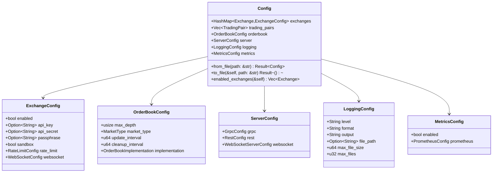

# Config Module

## Overview

The config module handles configuration management for the aggregator-core library.

## Configuration Structure

The `Config` struct handles various sub-configurations like exchanges, trading pairs, servers, logging, and metrics.

### Full Configuration Tree



The embedded Mermaid diagram illustrates the full tree structure.

### Loading Configuration from JSON

The config can be loaded using:

```rust
let config = Config::from_file("path/to/config.json").unwrap();
```

### Code Sample Modifying Config

Modify the configuration like this:

```rust
let mut config = Config::default();
config.exchanges.get_mut(&Exchange::Binance).unwrap().enabled = false;
```

## Environment Variables

Environment variables can override configuration values. The precedence is as follows: Environment Variables -> Config Files -> Default Values.

## Configuration Files

Configuration is typically stored in JSON files, and they include sections for each exchange and operating parameters.

## Detailed Field/Function Tables

### Config Struct Fields

| Field | Type | Description |
|-------|------|-------------|
| `exchanges` | `HashMap<Exchange, ExchangeConfig>` | Exchange-specific configurations |
| `trading_pairs` | `Vec<TradingPair>` | Supported trading pairs |
| `orderbook` | `OrderBookConfig` | Order book configuration |
| `server` | `ServerConfig` | Server configuration |
| `logging` | `LoggingConfig` | Logging configuration |
| `metrics` | `MetricsConfig` | Metrics configuration |

### ExchangeConfig Fields

| Field | Type | Description |
|-------|------|-------------|
| `enabled` | `bool` | Whether exchange is enabled |
| `api_key` | `Option<String>` | API key for authentication |
| `api_secret` | `Option<String>` | API secret for authentication |
| `passphrase` | `Option<String>` | Additional passphrase if required |
| `sandbox` | `bool` | Whether to use sandbox environment |
| `rate_limit` | `RateLimitConfig` | Rate limiting configuration |
| `websocket` | `WebSocketConfig` | WebSocket configuration |

### Config Methods

| Method | Parameters | Returns | Description |
|--------|------------|---------|-------------|
| `from_file` | `path: &str` | `Result<Self>` | Load configuration from JSON file |
| `to_file` | `&self, path: &str` | `Result<()>` | Save configuration to JSON file |
| `enabled_exchanges` | `&self` | `Vec<Exchange>` | Get list of enabled exchanges |
| `default` | | `Self` | Create default configuration |

### Default Values

| Component | Default Value | Description |
|-----------|---------------|-------------|
| Rate Limit | 10 requests/sec, burst 20 | Default rate limiting |
| WebSocket | 5s reconnect, 30s ping | Default WebSocket settings |
| Order Book | 20 levels, BTreeSet | Default order book settings |
| gRPC Server | 0.0.0.0:50051 | Default gRPC bind address |
| REST Server | 0.0.0.0:8080 | Default REST bind address |
| WebSocket Server | 0.0.0.0:8081 | Default WebSocket bind address |
| Logging | "info" level, JSON format | Default logging configuration |
| Metrics | Prometheus on 0.0.0.0:9090 | Default metrics configuration |

## API Reference

Refer to the Rust documentation for function details. Cross-link to:
- [Aggregator Documentation](aggregator.md)
- [Types Documentation](types.md)
