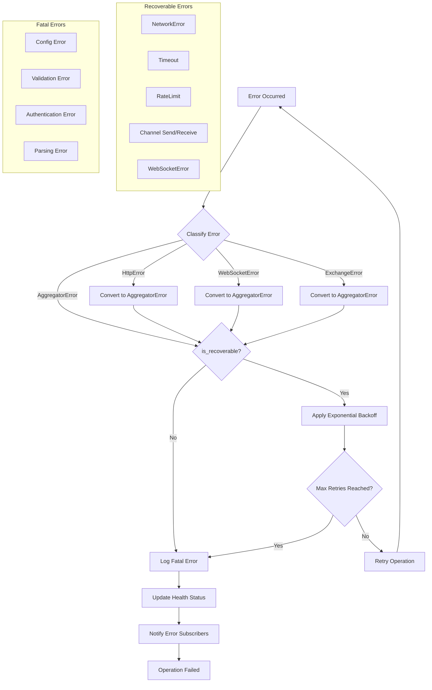

# Error Module

## Overview

The error module provides comprehensive error handling and error type definitions for the aggregator-core library.

## Error Types

The `AggregatorError` enum encapsulates all errors in the application, including:
- **Config Error**
- **Serialization Error**
- **Channel Send/Receive Errors**

Several subordinate enums like `HttpError` and `WebSocketError` describe specific error domains.

### Example `match` on `AggregatorError`

```rust
match result {
    Ok(_) => println!("Success!"),
    Err(AggregatorError::Config(err)) => println!("Config error: {}", err),
    Err(e) => println!("Other error: {}", e),
}
```

## Error Handling Flow



## Error Handling Patterns

The module supports error conversion to make the application resilient.

## Error Recovery

For recoverable errors, such as network timeouts, exponential backoff and retry mechanisms are commonly employed.

## Detailed Field/Function Tables

### AggregatorError Variants

| Variant | Fields | Description |
|---------|--------|-------------|
| `Config` | `ConfigError` | Configuration-related errors |
| `Serialization` | `serde_json::Error` | JSON serialization/deserialization errors |
| `ChannelSend` | `message: String` | Channel send operation failures |
| `ChannelReceive` | `message: String` | Channel receive operation failures |
| `ExchangeError` | `exchange: String, message: String` | Exchange-specific errors |
| `OrderBookError` | `operation: String, message: String` | Order book operation errors |
| `NetworkError` | `message: String` | Network connectivity errors |
| `HttpRequestError` | `status_code: u16, message: String` | HTTP request failures |
| `WebSocketError` | `message: String` | WebSocket connection errors |
| `Parsing` | `data_type: String, message: String` | Data parsing errors |
| `Timeout` | `operation: String, duration_ms: u64` | Operation timeout errors |
| `Validation` | `field: String, message: String` | Input validation errors |
| `Authentication` | `message: String` | Authentication failures |
| `RateLimit` | `resource: String, message: String` | Rate limiting errors |
| `NotFound` | `resource: String, id: String` | Resource not found errors |

### Subordinate Error Enums

#### HttpError

| Variant | Fields | Description |
|---------|--------|-------------|
| `Request` | `reqwest::Error` | HTTP request failures |
| `InvalidResponse` | `message: String` | Invalid HTTP response |
| `StatusCode` | `code: u16, message: String` | HTTP status code errors |

#### WebSocketError

| Variant | Fields | Description |
|---------|--------|-------------|
| `Connection` | `message: String` | WebSocket connection failures |
| `Protocol` | `message: String` | WebSocket protocol errors |
| `Send` | `message: String` | Message send failures |
| `Receive` | `message: String` | Message receive failures |
| `Handshake` | `message: String` | WebSocket handshake failures |

#### ExchangeError

| Variant | Fields | Description |
|---------|--------|-------------|
| `Connection` | `exchange: String, message: String` | Exchange connection failures |
| `Authentication` | `exchange: String, message: String` | Exchange authentication failures |
| `RateLimit` | `exchange: String, message: String` | Exchange rate limit exceeded |
| `InvalidSymbol` | `exchange: String, symbol: String, message: String` | Invalid trading symbol |
| `ApiError` | `exchange: String, code: String, message: String` | Exchange API errors |

### AggregatorError Methods

| Method | Parameters | Returns | Description |
|--------|------------|---------|-------------|
| `parsing` | `data_type: T, message: T` | `Self` | Create parsing error |
| `exchange` | `exchange: T, message: T` | `Self` | Create exchange error |
| `network` | `message: T` | `Self` | Create network error |
| `timeout` | `operation: T, duration_ms: u64` | `Self` | Create timeout error |
| `validation` | `field: T, message: T` | `Self` | Create validation error |
| `not_found` | `resource: T, id: T` | `Self` | Create not found error |
| `is_recoverable` | `&self` | `bool` | Check if error is recoverable |
| `category` | `&self` | `&'static str` | Get error category string |

### Recoverable Error Paths

The following error types are considered recoverable and can be retried:
- `NetworkError`
- `WebSocketError`
- `Timeout`
- `RateLimit`
- `ChannelSend`
- `ChannelReceive`

## API Reference

Please refer to the Rust docs for detailed descriptions of each error type and their methods. Cross-link to:
- [Types Documentation](types.md)
- [Config Documentation](config.md)
